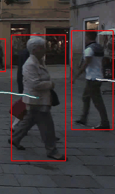

# Demonstrations of My projects
## 1. Multi-Object Tracking Based on Motion Prediction and Occlusion Recovery
### 1.1 Algorithm 

This algorithm is a tracking-by-detection method, and focus on the impact of motion prediction on Object Tracking. Most of current tracking methods concentrate on feature extraction and object detector, and pay less attention on the temporal property of tracking task. .

*==I'll add more details when I finish my paper.==*

### 1.2 Innovations and difficulties
**Innovations:** 

- Considering the high-order Markov chain and Kalman Smoothing to decrease the uncertainties of bbox caused by the instability of Object Detector. 

- Kalman Prediction is used to predict the states of bboxes of temporary loss.

- For the occluded target, Relative Motion Model and *Trajectory* Prediction Model are used to recover bboxes' states during their occlusion.

**Difficulties:** 

- Loss of bboxes caused by appearance distortion, lighting changes, fast motion and motion blur, and similar background interference.

- Mismatched trajectories caused by out-of-plane rotation, in-plane rotation, scale changes, occlusion and out of view, etc.

- Current tracking algorithms pay less attention to the trajectory prediction module and cannot predict the possible future collisions of the target

### 1.3 Occlusion processing
|Trajectory recovery  base on relative motion model|Trajectory prediction|
|:-:|:-:|
|||

Occlusion processing module can predict the trajectory and speed of the target for a period of time to foresee possible future collisions

### 1.4 Expand to 3D

### 1.5 To do list
- [ ] Add trajectories clustering to analyze trajectories in group.
- [ ] Add trajectories frequent mode detection, to replace motion model and predict the occurrence of accidents.
- [ ] Compare different time series prediction methods in MOT.

----

## 2. Tracking Based on Correlation Filter

Re- implementation of classic Correlation Filter Based Single Object Tracking algorithm. MOSSE code can be found in my repository.

|           $fi$           |                  $gi$                   |
| :----------------------: | :-------------------------------------: |
|   |                 |
|           $hi$           |              tracking image              |
|  |  |

The most striking advantage of CF based tracking method is its high efficiency. The original MOSSE can achieve 669 FPS. And  many researchers used different features to improve performance, but with little success.
|MOSSE|CSK|CN|KCF|SAMF, DSST|
|:-:|:-:|:-:|:-:|:-:|
|Gray|Gray Circulant matrix|CSK+RGB|CSK+HOG|Multi-feature|
However, the classic CF based tracking methods are only applied to Single Object Tracking. In recent years, some researchers have extended it to multi-target tracking, but this is not a successful extension. In fact, their methods are just multi-SOT rather than MOT. They just track a single object and combine their results without considering the relationship between the targets. Some tiny summary of high citations papers are as follows, and as the number of targets increases, FPS will drop sharply, and the advantages of the CF method will be lost.

|YEAR |CITATIONS| TITILE | Method to combine CF | NOTES |
| :-: | :-: | :-: | :- | :- |
|2017|51|Sequential Sensor Fusion Combining Probability Hypothesis Density and Kernelized Correlation Filters for Multi-Object Tracking in Video Data|1. Combine GMPHD with CF   2. Just use CF to correct the covariance and mean of GMPHD's estimation   3. Multi - SOT | Apply CF to all the target, decrease FPS |
|2018|21|Multi-Object Tracking with Correlation Filter for Autonomous Vehicle| 1. Improve detection module by incorporating the temporal information, which is beneficial for detecting small objects; For the tracking module, propose a novel compressed deep CNN feature based CF tracker.   2. Use the response of CF to represent the unrelibility of current track.   3. ACPE is applied to appearence similarity matrix.|Give the summaries of affinity models and data association methods.  Key point matching. |
|2019|21|Multi-object tracking with discriminantcorrelation filter based deep learning tracker|Really LOW FPS||
|2017|23|Multiple Object Tracking with Kernelized Correlation Filters in Urban Mixed Traffic| They didn’t benefit from the CNN features and only used the overlap between the tracking box and detection to confirm the validity of tracking, which may fail in crowded scenarios. ||

