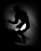
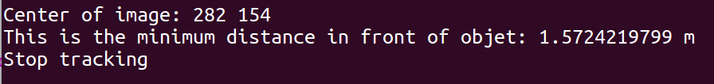

# My projects
 My projects

## 1. Multi-Object Tracking Based on Motion Prediction and Occlusion Recovery
### 1.1 Algorithm 

This algorithm is a tracking-by-detection method, and focus on the impact of motion prediction on Object Tracking. Most of current tracking methods concentrate on feature extraction and object detector, and pay less attention on the temporal property of tracking task. .

*I'll add more details when I finish my paper.*

### 1.2 Innovations and difficulties
**Innovations:** 

- Considering the high-order Markov chain and Kalman Smoothing to decrease the uncertainties of bbox caused by the instability of Object Detector. 

- Kalman Prediction is used to predict the states of bboxes of temporary loss.

- For the occluded target, Relative Motion Model and Trajectory Prediction Model are used to recover bboxes' states during their occlusion.

**Difficulties:** 

- Loss of bboxes caused by appearance distortion, lighting changes, fast motion and motion blur, and similar background interference.

- Mismatched trajectories caused by out-of-plane rotation, in-plane rotation, scale changes, occlusion and out of view, etc.

- Current tracking algorithms pay less attention to the trajectory prediction module and cannot predict the possible future collisions of the target

### 1.3 Occlusion processing
|Trajectory recovery  base on relative motion model|Trajectory prediction|
|:-:|:-:|
|||

Occlusion processing module can predict the trajectory and speed of the target for a period of time to foresee possible future collisions

### 1.4 Expand to 3D

### 1.5 To do list
- [ ] Add trajectories clustering to analyze trajectories in group.
- [ ] Add trajectories frequent mode detection, to replace motion model and predict the occurrence of accidents.
- [ ] Compare different time series prediction methods in MOT.

----

## 2. Tracking Based on Correlation Filter

Re- implementation of classic Correlation Filter Based Single Object Tracking algorithm. MOSSE code can be found in my repository.

|tracking image|
|:-:|
|   |

 fi|gi|hi| 
 :----------------------: | :-------------------------------------: |:-:|
 |||

The most striking advantage of CF based tracking method is its high efficiency. The original MOSSE can achieve 669 FPS. And  many researchers used different features to improve performance, but with little success.
|MOSSE|CSK|CN|KCF|SAMF, DSST|
|:-:|:-:|:-:|:-:|:-:|
|Gray|Gray Circulant matrix|CSK+RGB|CSK+HOG|Multi-feature|

However, the classic CF based tracking methods are only applied to Single Object Tracking. In recent years, some researchers have extended it to multi-target tracking, but this is not a successful extension. In fact, their methods are just multi-SOT rather than MOT. They just track a single object and combine their results without considering the relationship between the targets. Some tiny summary of high citations papers are as follows, and as the number of targets increases, FPS will drop sharply, and the advantages of the CF method will be lost.

|YEAR |CITATIONS| TITILE | Method to combine CF | NOTES |
| :-: | :-: | :-: | :- | :- |
|2017|51|Sequential Sensor Fusion Combining Probability Hypothesis Density and Kernelized Correlation Filters for Multi-Object Tracking in Video Data|1. Combine GMPHD with CF   2. Just use CF to correct the covariance and mean of GMPHD's estimation   3. Multi - SOT | Apply CF to all the target, decrease FPS |
|2018|21|Multi-Object Tracking with Correlation Filter for Autonomous Vehicle| 1. Improve detection module by incorporating the temporal information, which is beneficial for detecting small objects; For the tracking module, propose a novel compressed deep CNN feature based CF tracker.   2. Use the response of CF to represent the unrelibility of current track.   3. ACPE is applied to appearence similarity matrix.|Give the summaries of affinity models and data association methods.  Key point matching. |
|2019|21|Multi-object tracking with discriminantcorrelation filter based deep learning tracker|Really LOW FPS||
|2017|23|Multiple Object Tracking with Kernelized Correlation Filters in Urban Mixed Traffic| They didn’t benefit from the CNN features and only used the overlap between the tracking box and detection to confirm the validity of tracking, which may fail in crowded scenarios. ||

## 3. ROS Object Tracking and Planning

### 3.1  Purpose of the tp5_ros_package
The purpose of the TP is to see in practice a tracking object within a concrete example, using the simulated TurtleBot2 in Gazebo or on real TurtleBot2. In particular, to track an object in the robot’s environment by using the RGB-D (colour and depth) sensor of TurtleBot2. In the TP, the object is a red balloon or a joker with Aruco Markers.

The provided ROS package allows to track object which is done by the functions as follows:
- process_random_image: Processing of image with a random picture with Aruco Makers.
- process_image_circle : Processing of an image with a circle.

## 3.2 Starting the tp5_ros_package with default parameters
To launch the code, the user can launch directly the ROS simulator by opening a new Terminal and run the code as follows:
- roslaunch tp5_ros_package TP5.launch
To visualize the data captured by the sensor, the user needs launch the RVIZ:
- rosrun rviz rviz tp-5.rviz

### 3.3 Using the tp5_ros_package with default parameters
After executing the simulator, the user will see the simulation environment of Gazebo:

After launching the Rviz, user will see the image captured by the RGB sensor and Depth sensor, and user need to add a processed_Image topic for subscribing the processed image. Now because we haven’t executed the code, so there is no processed image:

#### 3.3.1 Using the tp5_ros_package with Object Tracking Program
In this case, the screen will display the information as follows:  
If there is no Aruco markers in the field of view, the Turtlebot will rotate to find the Aruco markers
- "No Aruco markers in the field of view."
- "Rotate to find"

To display the center found:
- "Center of image:"

If the distance is large than the maximum distance, move the TurtleBot close to the objet:
- "too far"
- "moving the TurtleBot close to the object"
  
To display the average distance between the TurtleBot2 and the object:
- "Average Distance"
  
If the distance is close enough or can't one of the Aruco marker will disappear, stop tracking:
- "This is the minimum distance in front of object:"
- "Stop tracking"
  
If there is some problem for calculating the depth, move the TurtleBot:
- "can't calculate the distance, moving to close to object"

**For the case of circle**:

When there is no circle in the TurtleBot2 vision, it will rotate to find a new circle.
At the end, the TurtleBot will stop at the given distance from the balloon.
The tracking process will stop when the two conditions are met:
  1. The distance between the target and the TurtleBot2 is less than given distance (here is 1.6m).
  2. The center of circle is on the center of Robot vision
   

The Terminal will display the information of circle’s center position and its radius.

**For the case of Joker:**
When there is no Aruco markers in the TurtleBot2 vision, it will rotate to find a new circle.
At the end, the TurtleBot will stop at the given distance from the joker.
The tracking process will stop when the two conditions are met:
  1. The distance between the target and the TurtleBot2 is less than given distance (here is 1.6m) and one of the Aruco marker’s center is too close to the image edge.
  2. The center of circle is on the center of Robot vision

The Terminal will display the information of joker's center position and its radius.

### 3.4 Demo
In the first Demo, I will show you:	
1. When the target disappears from the robot vision, to find the circle and the joker.
2. Control the motion of the robot to have the target near the center of its vision with a given 	distance from it.

In the second Demo, I will show you how to track the circle.

The third Demo is in real environnement.

